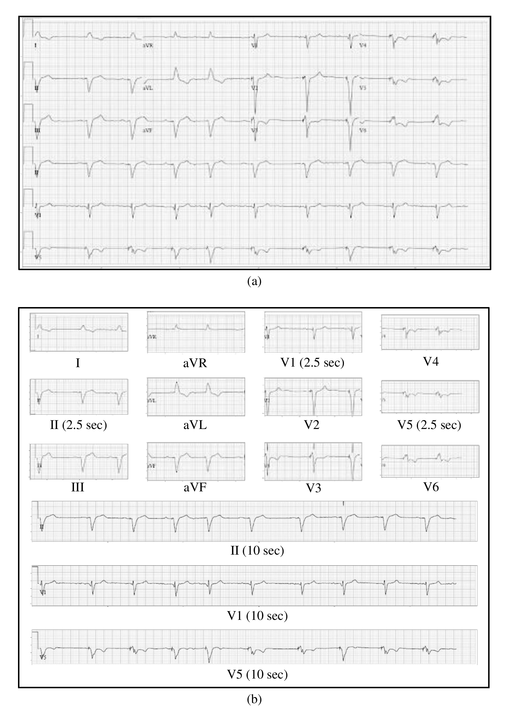
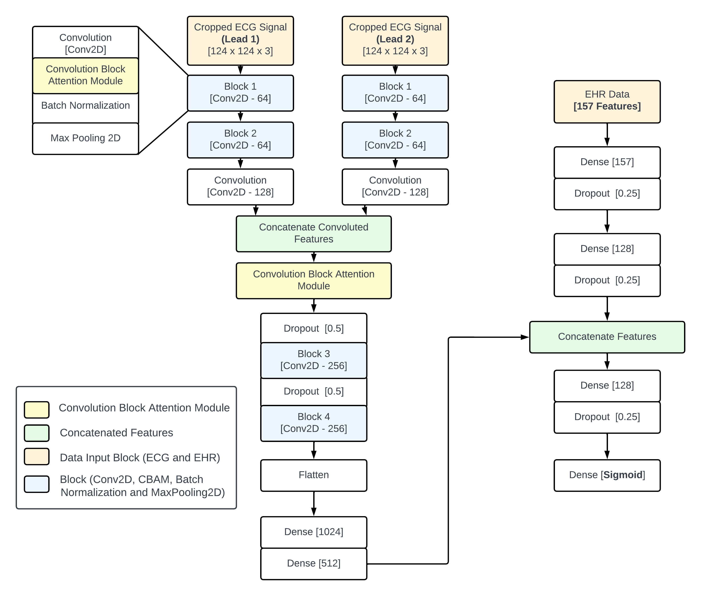
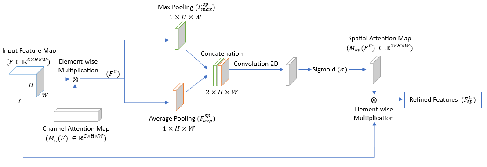
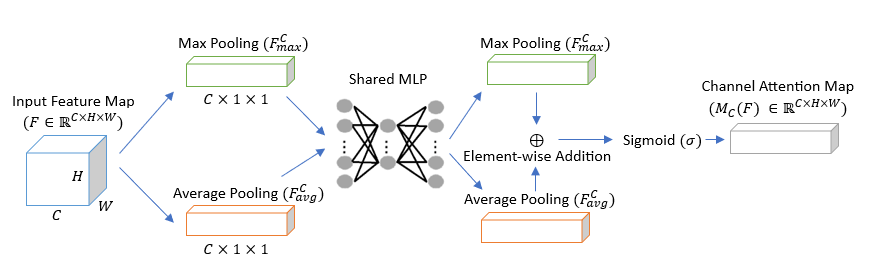
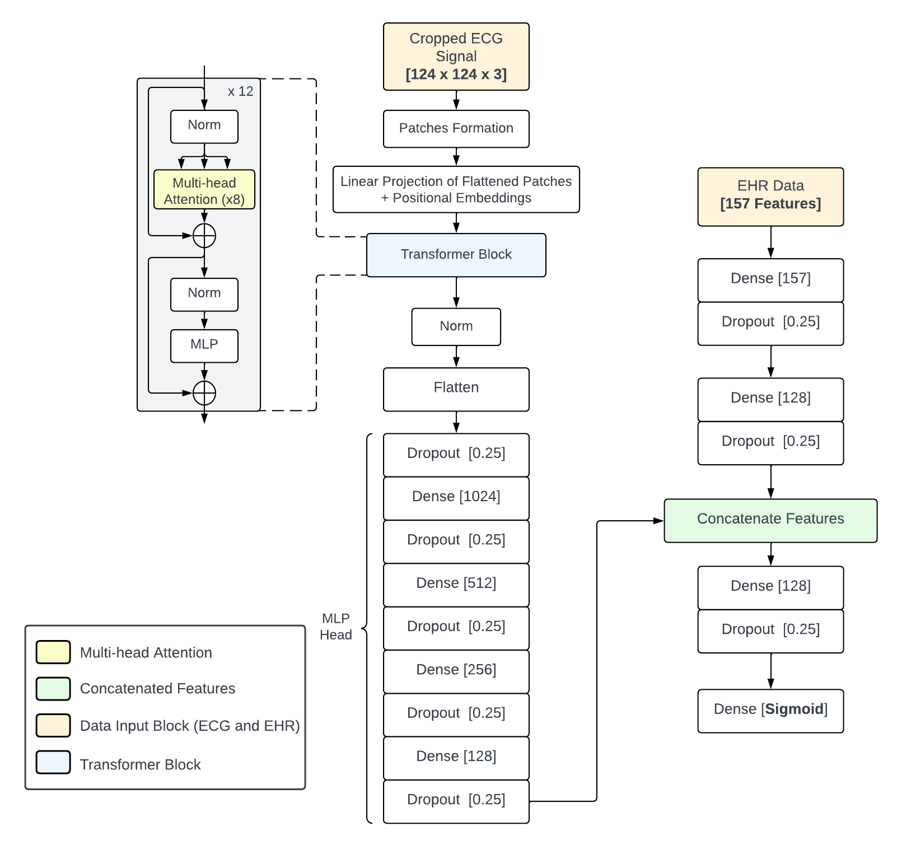
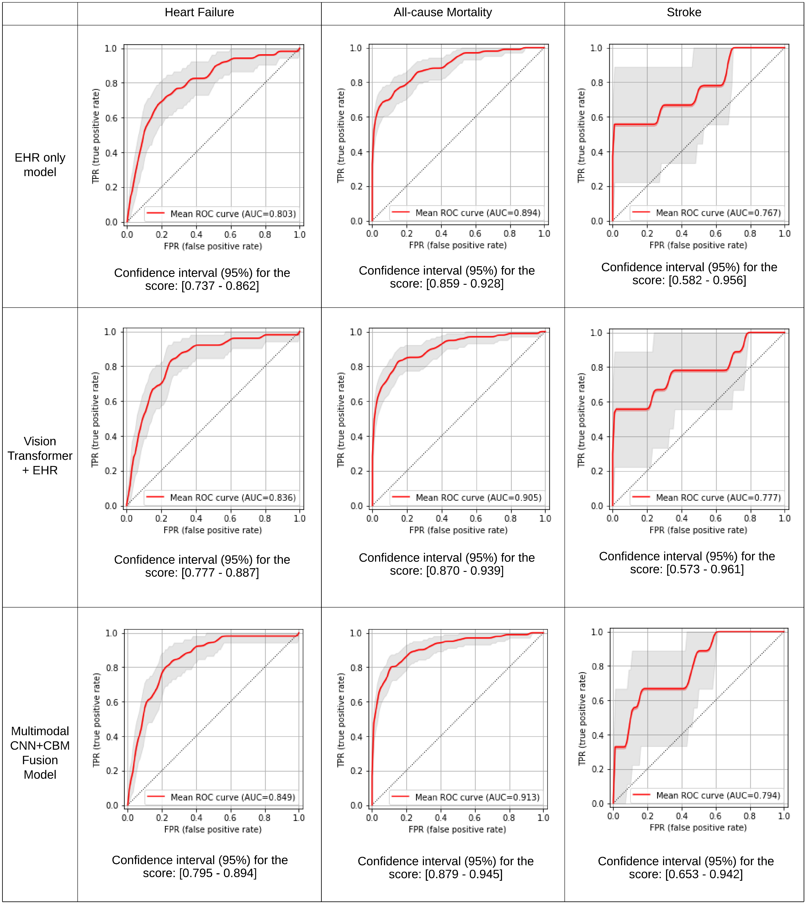

# Comparative_Analysis_of_CNN-CBAM_Fusion_Model_and_ViT
The code for comparative analysis of CNN+CBAM and ViT for processing ECG image data in joint fusion with EHR data for post-PCI prognosis. 

## Background
Assessing the patient's prognosis after undergoing PCI (Percutaneous Coronary Intervention) is vital for understanding their recovery trajectory and potential risks post-procedure. This evaluation not only aids in gauging the intervention's efficacy but also in predicting the probability of future cardiovascular incidents. We have proposed a multimodal, joint-fusion based multibranch CNN+CBAM model targeting the prediction of three different clinical endpoints i.e. heart failure hospitalization, all-cause mortality, and ischemic stroke (6-months post-PCI).


## Data
We have considered Electrocardiogram (ECG) and Electronic Health Reacords (EHR) data of patients.

### Data preprocessing - ECG Cropping 
**The ECG data images are preprocessed before being sent to the model**



## Proposed Models

We have implemented a hybrid fusion model consisting of multibranched CNN with Attention (CBAM) for processing ECG data and a feed forward neural network for processing the Electronic Health Record(EHR) data.

For comparative benchmarking, we have used a Vision Transformer (ViT) model instead of CNN+CBAM branch for processing ECG images while keeping same feed forward neural network architecture for EHR data processing.

## CNN+CBAM Fusion Model Architecture
Overall Architecture


Spatial Attention Module


Channel Attention Module



## ViT Fusion Model Architecture


## How to Implement? 

Run the **main.py** file using the code present below, it takes a CSV file containing EHR data as an input along with the model you want to consider for processing the ECG data branch i.e. either CNN+CBAM or ViT.
**The EHR data was named as "Share_data_outcome_deidentified.csv" in our case**

```python
!python3 main.py -i <input-csv-file> -m <model-name>
```

where `<input-csv-file>` represents the CSV file containing the EHR data, in our case it's named as "Share_data_outcome_deidentified.csv". The `<model-name>` argument indicates the model which you wish to run, which could be either CNN or ViT.

Example...
```python
!python3 main.py -i Share_data_outcome_deidentified.csv -m CNN
```
This will automatically save the ROC curves along with confidence intervals (CI) in "ROC_Outcomes" directory.
**The data we worked on has not been uploaded yet.**

## Result

**The results obtained and the comparisons have been mentioned in our manuscript.**
Following table displays the obtained ROC curves along with CI.

